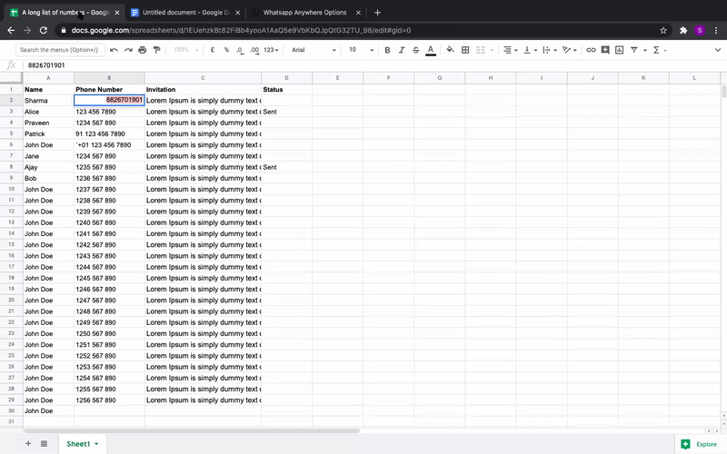

A browser extension to turn any phone number on web into a clickable whatsapp link

## How to install

### On Chrome Browser

Easiest way to install the extension is via [chrome web store](https://chrome.google.com/webstore/detail/whatsappanywhere/heffladfhbegcoandackbpkddkinfmag)

Alternatively you can install from the source code directly. Here's a [guide to install the chrome extension from source code](https://stackoverflow.com/a/24577660).

## Problem

Multiple times in a day, I want to whatsapp to phone numbers which are not stored in my phonebook; rather they are somewhere in excel sheets or linkedin/twitter/slack chats or in google search results, etc. Storing number in phonebook takes significant amount of time. This is why I use whatsapp web to send message to those numbers using whatsapp API link. Again creating this link takes significant time and prone to errors. 

* How can I save time? 
* Can I save message as template to send the same message to multiple people?

## Solution

`whatsapp-anywhere` is a **browser extension**, that turns all the phone numbers you see on any web page(google sheets, documents, chats, social media, websites, etc.). 

This is how it works
1. Select the phone number text
2. Right click to find the whatsapp message link
3. Click -> You will be redirected to whatsapp message window

You can save a template message in case you need to send same message to multiple people

## Roadmap

### Feature Roadmap

- [x] Right click context menu with whatsapp message hyperlink for the selected text
- [x] Support different formats of phone numbers e.g. 911234567890, 91 123 456 7890, 1234567890, (910) 123456789, ....and so on
- [x] Extension options page to change default country code and default message
- [ ] Open Whatsapp Message page on the same page (instead of new tab)
- [ ] Descriptive error messages shown early(e.g. number is not supported shown without the need of click)
- [ ] Don't show hyperlink for non-number text
- [ ] Support **multiple** template messages to choose from
- [ ] Remove the need to click on "open whatsapp in browser" and "hit send"
- [ ] Script to build final distribution packages via command line

### Browser-Support

| Browser | Support |
|-----|----|
| Chrome | YES |
| Firefox | NOT YET |
| Safari | NOT YET |

## Call For Contribution

Invite you all to contribute to the project to make this even better. Some ideas to contribute

- [Create issues](https://github.com/gitcommitshow/whatsapp-anywhere/issues/new) for the bugs you discover, feature suggestions, etc.
- Add a feature or fix a bug and make a pull request to merge
- Suggest design changes
- Create design assets to make this look better
